# POC Migrasi Aplikasi WAFR: Production Legacy → Kubernetes

| | |
|---|---|
| **Dokumen** | Proof of Concept (POC) Migrasi WAFR |
| **Author** | Elang |
| **Tanggal** | 2025-05-05 |
| **Update Terakhir** | 2025-05-11 |
| **Status** | Draft / Testing Phase |

---

## Daftar Isi

1. [Tujuan POC](#1-tujuan-poc)
2. [Ruang Lingkup](#2-ruang-lingkup)
3. [Arsitektur & Environment](#3-arsitektur--environment)
4. [Skenario Pengujian](#4-skenario-pengujian)
   - [TC-01: Validasi Data (Data Parity)](#tc-01-validasi-data-data-parity)
   - [TC-02: Pod Failure — Ketersediaan Aplikasi saat Pod Dimatikan](#tc-02-pod-failure--ketersediaan-aplikasi-saat-pod-dimatikan)
   - [TC-03: Node Failure — Pod Rescheduling & Zero Downtime](#tc-03-node-failure--pod-rescheduling--zero-downtime)
   - [TC-04: Rolling Update tanpa Downtime](#tc-04-rolling-update-tanpa-downtime)
   - [TC-05: Load & Performance Baseline](#tc-05-load--performance-baseline)
   - [TC-06: Koneksi Database](#tc-06-koneksi-database)
   - [TC-07: Redis — Validasi Penyimpanan Cache/Session](#tc-07-redis--validasi-penyimpanan-cachesession)
5. [Alat & Prasyarat](#5-alat--prasyarat)
6. [Kriteria Keberhasilan (Success Criteria)](#6-kriteria-keberhasilan-success-criteria)
7. [Hasil Pengujian](#7-hasil-pengujian)
8. [Risiko & Mitigasi](#8-risiko--mitigasi)

---

## 1. Tujuan POC

POC ini bertujuan membuktikan bahwa aplikasi **WAFR** yang dijalankan di atas cluster **Kubernetes** mampu:

1. **Menampilkan data yang identik** dengan aplikasi WAFR di environment Production Legacy.
2. **Tetap tersedia (highly available)** meskipun salah satu pod dimatikan, mengingat deployment dikonfigurasi dengan **2 replica (hingga 10 dengan HPA)**.
3. **Melakukan rescheduling pod secara otomatis** tanpa downtime ketika sebuah node Kubernetes mati.
4. _(Tambahan)_ Mendukung rolling update tanpa downtime.
5. _(Tambahan)_ Memberikan performa yang baik untuk environment production=.
6. _(Tambahan)_ Memastikan koneksi database berjalan dengan benar.
7. _(Tambahan)_ Memastikan operasi baca/tulis ke **Redis Sentinel** berjalan dengan benar dari dalam pod, termasuk validasi failover otomatis saat primary Redis mati.

---

## 2. Ruang Lingkup

| Item | Termasuk | Tidak Termasuk |
|---|---|---|
| Aplikasi WAFR | ✅ | |
| Kubernetes cluster (existing) | ✅ | |
| Production Legacy WAFR | ✅ (read-only, hanya perbandingan) | |
| Redis Sentinel (1 primary, 3 slave) | ✅ | |
| Migrasi data/database | ❌ | Tidak dilakukan pada POC |
| Setup CI/CD pipeline | ❌ | Di luar scope POC |
| Konfigurasi monitoring (Prometheus/Grafana) | ✅ | |

---

## 3. Arsitektur & Environment

```text
┌──────────────────────────────────────────────────────────────────────┐
│                         PRODUCTION LEGACY                            │
│   [WAFR App Server]  ──►  [Database: 120]                            │
│   (Bare metal / VM)                                                  │
└──────────────────────────────────────────────────────────────────────┘
                              │
                              ▼ Perbandingan Data (TC-01)
┌──────────────────────────────────────────────────────────────────────┐
│                      KUBERNETES CLUSTER (Target)                     │
│                                                                      │
│   ┌──────────────────────────────────────────────────────────────┐   │
│   │           Master Node — 192.168.200.101                      │   │
│   │   (API Server · Scheduler · Controller Manager · etcd)       │   │
│   └──────────────────────────┬───────────────────────────────────┘   │
│                              │                                       │
│          ┌───────────────────┼───────────────────┐                   │
│          │                   │                   │                   │
│  ┌───────────────┐   ┌───────────────┐   ┌───────────────┐           │
│  │ Worker Node 1 │   │ Worker Node 2 │   │ Worker Node 3 │           │
│  │192.168.200.102│   │192.168.200.103│   │192.168.200.181│           │
│  └───────┬───────┘   └───────┬───────┘   └───────┬───────┘           │
│          │                   │                   │                   │
│          │           ┌───────┴───────┐           │                   │
│          └───────────┤ Worker Node 4 ├───────────┘                   │
│                      │192.168.200.182│                               │
│                      └───────┬───────┘                               │
│                              │                                       │
│          ┌───────────────────┴───────────────────┐                   │
│          │    [Service / Ingress / LoadBalancer] │                   │
│          │             wafr-prod-k8s             │                   │
│          └───────────────────┬───────────────────┘                   │
│                              │                                       │
│             ┌────────────────┴────────────────────────┐              │
│             │                                         │              │
│      [Database: 120]                 [Redis Sentinel Cluster]        │
│                                               │                      │
│                              ┌────────────────┴──────────────┐       │
│                              │                               │       │
│                    ┌─────────────────┐             ┌─────────┴─────┐ │
│                    │  Redis Primary  │             │   Sentinel    │ │
│                    │  (1 pod, R/W)   │             │   Processes   │ │
│                    └────────┬────────┘             └───────────────┘ │
│                             │                                        │
│              ┌──────────────┴──────────────┐                         │
│              │                             │                         │
│   ┌──────────────────┐         ┌──────────────────┐                  │
│   │  Redis Replica 1 │         │  Redis Replica 2 │                  │
│   │  (read-only)     │         │  (read-only)     │                  │
│   └──────────────────┘         └──────────────────┘                  │
│              │                             │                         │
│   ┌──────────────────┐                     │                         │
│   │  Redis Replica 3 │                     │                         │
│   │  (read-only)     │─────────────────────┘                         │
│   └──────────────────┘                                               │
└──────────────────────────────────────────────────────────────────────┘
```

### Environment Detail

| Parameter | Production Legacy | Kubernetes (Target) |
|---|---|---|
| Master Node | — | 192.168.200.101 |
| Worker Nodes | — | 192.168.200.102 / .103 / .181 / .182 |
| Database | 120 | 120 (sama dengan production) |
| Redis | — | Sentinel mode: 1 primary + 3 slave |
| URL Akses | wafr _(internal)_ | wafr-prod-k8s |
| Replica | N/A | 2 (hingga 10 via HPA) |
| Namespace | N/A | wafr-wahana |

---

## 4. Skenario Pengujian

---

### TC-01: Validasi Data (Data Parity)

**Tujuan:** Memastikan data yang ditampilkan oleh aplikasi WAFR di Kubernetes identik dengan data di Production Legacy.

**Prasyarat:**
- Aplikasi WAFR di Kubernetes sudah running dan terhubung ke database yang sama atau database yang telah disinkronisasi.
- Akses ke URL Legacy dan URL Kubernetes tersedia.

**Checklist Validasi Manual (UI):**

| No. | Halaman / Fitur | Legacy | Kubernetes | Sama? |
|---|---|---|---|---|
| 1 | Halaman utama / dashboard | landing page | landing page | ✅ |
| 2 | Daftar data report | Report Service Berkala | Report Service Berkala | ✅ |
| 3 | Detail isi report | Detail Service Berkala | Detail Service Berkala | ✅ |
| 4 | Pencarian / filter | Search by kolom Dikerjakan oleh | Search by kolom Dikerjakan oleh | ✅ |

**Kriteria Lulus:** Semua data yang ditampilkan di UI identik antara Legacy dan Kubernetes.

---

### TC-02: Pod Failure — Ketersediaan Aplikasi saat Pod Dimatikan

**Tujuan:** Membuktikan bahwa dengan 2 replica, mematikan 1 pod tidak menyebabkan downtime.

**Prasyarat:**
- Deployment WAFR berjalan dengan `replicas: 2`.
- Tool monitoring aktif (curl loop / watch).

**Langkah Pengujian:**

```bash
# Terminal 1 — Monitor pod secara terus-menerus
watch kubectl get pods -n wafr-wahana

# Terminal 2 — Cek pod yang sedang running beserta node-nya
kubectl get pods -n wafr-wahana -l app=wafr -o wide

# Catat nama pod yang akan dimatikan
POD_TO_KILL="wafr-6d4f8b-xxxx"

# Matikan 1 pod
kubectl delete pod $POD_TO_KILL -n wafr-wahana

# Pantau pod baru yang dibuat otomatis
kubectl get pods -n wafr-wahana -l app=wafr -w
```

**Observasi yang Dicatat:**

| Parameter | Nilai |
|---|---|
| Waktu pod didelete | 14:29:20 WIB |
| Waktu pod baru Ready | 14:29:33 WIB |
| Apakah aplikasi tetap bisa diakses? | ✅ Masih |

**Kriteria Lulus:** Monitor di Terminal 1 tidak menunjukkan error selama proses delete pod. Kubernetes secara otomatis membuat pod pengganti hingga kembali ke 2 replica.

---

### TC-03: Node Failure — Pod Rescheduling & Zero Downtime

**Tujuan:** Membuktikan bahwa ketika sebuah worker node mati, pod yang ada di node tersebut akan dijadwalkan ulang ke worker node lain secara otomatis tanpa downtime.

**Prasyarat:**
- 4 worker node tersedia (192.168.200.102, .103, .181, .182).
- Akses SSH ke node atau hak akses untuk `kubectl cordon/drain`.

**Langkah Pengujian:**

```bash
# Terminal 1 — Monitor pod beserta node-nya sepanjang test
watch kubectl get pods -n wafr-wahana -o wide

# Terminal 2 — Identifikasi pod dan worker node-nya saat ini
kubectl get pods -n wafr-wahana -l app=wafr -o wide
# Tentukan worker node yang akan disimulasikan mati
TARGET_NODE="192.168.200.102"

# --- Opsi A: Drain node (graceful, direkomendasikan untuk test awal) ---
kubectl drain $TARGET_NODE --ignore-daemonsets --delete-emptydir-data --force

# --- Opsi B: Cordon node (node tidak menerima pod baru) ---
kubectl cordon $TARGET_NODE

# --- Opsi C: Matikan node secara hard (simulasi crash) ---
# HATI-HATI: lakukan hanya jika node tersebut aman untuk dimatikan
# ssh user@$TARGET_NODE "sudo shutdown -h now"

# Pantau rescheduling pod ke worker node lain
kubectl get pods -n wafr-wahana -l app=wafr -o wide -w

# Setelah test selesai, kembalikan node
kubectl uncordon $TARGET_NODE
```

**Observasi yang Dicatat:**

| Parameter | Nilai |
|---|---|
| Worker node yang dimatikan | _(IP node)_ |
| Pod yang terdampak | _(nama pod)_ |
| Waktu node tidak tersedia | _(timestamp)_ |
| Waktu pod baru dijadwalkan di node lain | _(timestamp)_ |
| Worker node tujuan rescheduling | _(IP node baru)_ |
| Waktu pod baru berstatus Running/Ready | _(timestamp)_ |
| Total waktu rescheduling | _(dalam detik)_ |
| Aplikasi tetap bisa diakses? | ✅ / ❌ |

**Kriteria Lulus:**
- Pod secara otomatis dijadwalkan ke worker node lain dalam waktu < 60 detik.
- Aplikasi masih bisa diakses selama proses rescheduling berlangsung.

---

### TC-04: Rolling Update tanpa Downtime

**Tujuan:** Membuktikan bahwa update image/konfigurasi aplikasi WAFR dapat dilakukan tanpa downtime menggunakan strategi Rolling Update.

**Prasyarat:**
- Tersedia image versi baru.
- Strategy deployment diset ke `RollingUpdate`.

**Konfigurasi Deployment yang Direkomendasikan:**

```yaml
spec:
  replicas: 2
  strategy:
    type: RollingUpdate
    rollingUpdate:
      maxSurge: 1        # Boleh ada 1 pod extra saat update
      maxUnavailable: 0  # Tidak boleh ada pod yang unavailable saat update
```

**Langkah Pengujian:**

```bash
# Terminal 1 — Monitor pod selama proses update
watch kubectl get pods -n wafr-wahana -o wide

# Terminal 2 — Trigger rolling update
kubectl rollout restart deployment/wafr -n wafr-wahana

# Pantau status rollout
kubectl rollout status deployment/wafr -n wafr-wahana
```

**Kriteria Lulus:** Tidak ada error selama proses rolling update berlangsung. Rollout selesai dengan status `successfully rolled out`.

---

### TC-05: Load & Performance Baseline

**Tujuan:** Memastikan performa aplikasi WAFR di Kubernetes cukup untuk handle Production, serta mengetahui batas kapasitas.

**Tool yang Digunakan:** Locust

**Script locust:**

```py
# locust.py
from locust import HttpUser, task, between
import urllib3

# Menonaktifkan peringatan SSL jika Anda mengetes server dengan sertifikat self-signed
urllib3.disable_warnings(urllib3.exceptions.InsecureRequestWarning)

class WahanaAuthUser(HttpUser):
    # Simulasi jeda antar request. 
    # Gunakan constant(0) jika ingin melakukan spam secepat mungkin tanpa jeda.
    wait_time = between(0.5, 2)
    
    # Host target
    host = "wafr-prod-k8s"

    @task
    def stress_test_login(self):
        """
        Melakukan POST request ke endpoint untuk autentikasi.
        """
        target_path = "<secret>"
        payload = {
            <secret>"
        }

        # Header standar untuk form submission
        headers = {
            "Accept": "application/json",
            "Content-Type": "application/json",
            "User-Agent": "Locust Stress Tester"
        }

        with self.client.post(
            target_path, 
            json=payload, 
            headers=headers, 
            verify=False, 
            catch_response=True
        ) as response:
            if response.status_code == 200:
                # Validasi tambahan jika perlu (opsional)
                if "token" in response.text or response.status_code == 200:
                    response.success()
                else:
                    response.failure("Login Berhasil (200) tapi data tidak sesuai")
            elif response.status_code == 401:
                response.failure("Autentikasi Gagal: Username atau Password salah")
            else:
                response.failure(f"Server Error: {response.status_code}")

    @task(1)
    def health_check(self):
        """Task ringan untuk memastikan endpoint bisa dijangkau"""
        self.client.get("<secret>", verify=False)

```

```bash
# Jalankan locust
locust -f locust.py
```

**Metrik yang Diperhatikan:**

| Metrik | Kubernetes | Keterangan |
|:---|:---|:---|
| Avg Response Time | 7961.44 ms | Performa rata-rata |
| P95 Response Time | 24000 ms | Latensi persentil 95 |
| Throughput (req/s) | 213.06 | Kapasitas beban |
| Error Rate | 3% | Kegagalan saat test |

**Kriteria Lulus:** Performa Kubernetes tidak lebih buruk dari 10% kegagalan.

---

### TC-06: Koneksi Database

**Tujuan:** Memastikan aplikasi WAFR di Kubernetes dapat membaca data ke database dengan benar.

**Langkah Pengujian:**

```bash
# 1. Verifikasi environment variable / secret koneksi DB
kubectl get secret wafr-db-secret -n wafr-wahana -o yaml
kubectl describe configmap wafr-config -n wafr-wahana

# 2. Test melihat data yang ada di database melalui UI
# - Hit endpoint aplikasi wafr di Kubernetes environment
# - Verifikasi apakah data muncul atau tidak
```

**Kriteria Lulus:**
- Koneksi ke database berhasil dari dalam pod.
- Bisa mengakses data yang ada di database.
- Tidak ada data yang hilang atau kurang.

---

### TC-07: Redis Sentinel — Validasi Penyimpanan Cache/Session & Failover

**Tujuan:** Memastikan aplikasi WAFR di Kubernetes dapat melakukan operasi **tulis** dan **baca** ke Redis Sentinel dengan benar, serta memverifikasi bahwa Sentinel mampu melakukan **failover otomatis** (promote slave → primary) ketika primary Redis mati — tanpa menyebabkan error pada aplikasi.

**Topologi Redis Sentinel:**
- **1 Primary pod** — menerima operasi tulis (R/W)
- **3 Slave pod** — replikasi dari primary, hanya baca (read replica)
- **3 Sentinel pod** — memonitor primary, mendeteksi kegagalan, dan melakukan vote untuk promote slave baru

**Prasyarat:**
- Redis Sentinel sudah running (`kubectl get pods -n wafr-wahana | grep redis`).
- Aplikasi WAFR terhubung ke Redis melalui **Sentinel service** (bukan langsung ke IP primary).
- Environment variable koneksi Sentinel sudah dikonfigurasi di deployment (sentinel host, port, master name).
- Diketahui endpoint aplikasi WAFR yang melakukan operasi ke Redis.

**Langkah Pengujian:**

**7.1 — Verifikasi Status Redis Sentinel**

```bash
# Cek semua pod Redis dan Sentinel
kubectl get pods -n redis-cluster -o wide

# Identifikasi pod primary saat ini via Sentinel
kubectl exec -it <sentinel-pod-name> -n wafr-wahana -- \
  redis-cli -p 26379 SENTINEL masters
# Catat: name, ip, port, flags (harus "master"), num-slaves, num-other-sentinels

# Verifikasi jumlah slave yang terkoneksi ke primary
kubectl exec -it <redis-primary-pod-name> -n wafr-wahana -- \
  redis-cli INFO replication
# Pastikan: role:master, connected_slaves:3
```

**7.2 — Verifikasi Koneksi Redis dari dalam Pod WAFR**

```bash
# Masuk ke salah satu pod WAFR
kubectl exec -it <wafr-pod-name> -n wafr-wahana -- sh

# Cek konektivitas ke Sentinel (port default: 26379)
redis-cli -h <sentinel-host> -p 26379 ping
# Output yang diharapkan: PONG

# Tanya Sentinel alamat primary saat ini
redis-cli -h <sentinel-host> -p 26379 SENTINEL get-master-addr-by-name <master-name>
# Output yang diharapkan: IP dan port primary

exit
```

**7.3 — Hit Endpoint yang Menyimpan Data ke Redis**

```bash
# Hit endpoint WAFR yang melakukan operasi tulis ke Redis
curl -v -X POST http://wafr-prod-k8s/wafr/<endpoint-redis> \
  -H "Content-Type: application/json" \
  -d '{"key": "value"}'

# Catat HTTP status code dan response body
```

**7.4 — Verifikasi Data Tersimpan di Redis Primary**

```bash
# Masuk ke pod Redis primary
kubectl exec -it <redis-primary-pod-name> -n wafr-wahana -- redis-cli

# Cek key yang tersimpan oleh aplikasi
KEYS *                        # List semua key
GET <key-yang-diharapkan>     # Baca nilai key
TTL <key-yang-diharapkan>     # Cek TTL / expiry

exit
```

**7.5 — Verifikasi Replikasi Data ke Slave**

```bash
# Baca key yang sama dari salah satu pod slave
# (slave hanya bisa dibaca, tidak bisa ditulis)
kubectl exec -it <redis-slave-1-pod-name> -n wafr-wahana -- \
  redis-cli GET <key-yang-diharapkan>
# Output yang diharapkan: nilai yang sama dengan di primary ✅
```

**7.6 — Verifikasi Data Redis Dapat Diakses oleh Pod WAFR Lain (Shared Cache)**

```bash
# Data sudah tersimpan via TC 7.3, verifikasi dari pod WAFR kedua
POD_2="wafr-6d4f8b-yyyy"
kubectl exec -it $POD_2 -n wafr-wahana -- \
  redis-cli -h <sentinel-host> -p 26379 SENTINEL get-master-addr-by-name <master-name>
# Kemudian baca key dari primary yang didapat:
kubectl exec -it $POD_2 -n wafr-wahana -- \
  redis-cli -h <primary-ip> -p 6379 GET <key-yang-diharapkan>
# Output yang diharapkan: nilai yang sama ✅
```

**7.7 — Simulasi Failover: Primary Redis Dimatikan**

```bash
# Terminal 1 — Monitor pod Redis dan Sentinel
watch kubectl get pods -n redis-cluster -o wide

# Terminal 2 — Monitor ketersediaan aplikasi WAFR
watch kubectl get pods -n wafr-wahana -o wide

# Terminal 3 — Matikan pod Redis primary
REDIS_PRIMARY_POD="redis-master-0"   # sesuaikan nama pod primary
kubectl delete pod $REDIS_PRIMARY_POD -n wafr-wahana

# Pantau proses failover oleh Sentinel:
# 1. Sentinel mendeteksi primary tidak tersedia (subjectively down → objectively down)
# 2. Sentinel melakukan vote (quorum)
# 3. Salah satu slave di-promote menjadi primary baru
# 4. Slave lain repoint ke primary baru
kubectl exec -it <sentinel-pod-name> -n wafr-wahana -- \
  redis-cli -p 26379 SENTINEL masters
# Pantau perubahan: ip primary berubah ke slave yang di-promote

# Verifikasi primary baru
kubectl exec -it <redis-slave-yang-jadi-primary> -n wafr-wahana -- \
  redis-cli INFO replication
# Pastikan: role:master
```

**7.8 — Verifikasi Data Tetap Ada Setelah Failover**

```bash
# Baca key dari primary baru
kubectl exec -it <redis-primary-baru-pod-name> -n wafr-wahana -- \
  redis-cli GET <key-yang-diharapkan>
# Output yang diharapkan: data masih ada ✅

# Verifikasi aplikasi WAFR bisa tulis ke primary baru
curl -v -X POST http://wafr-prod-k8s.wahana.com/wafr/<endpoint-redis> \
  -H "Content-Type: application/json" \
  -d '{"key": "post-failover-value"}'
# HTTP status harus 2xx ✅
```

**Observasi yang Dicatat:**

| Parameter | Nilai |
|---|---|
| Jumlah slave terkoneksi ke primary (sebelum failover) | _(catat, harapan: 3)_ |
| Jumlah Sentinel yang aktif | _(catat, harapan: 3)_ |
| Koneksi Redis Sentinel dari pod WAFR berhasil? | ✅ / ❌ |
| HTTP status code endpoint tulis ke Redis | _(catat)_ |
| Key berhasil tersimpan di primary? | ✅ / ❌ |
| Data berhasil direplikasi ke slave? | ✅ / ❌ |
| Waktu primary dimatikan | _(timestamp)_ |
| Waktu Sentinel mendeteksi primary mati | _(timestamp)_ |
| Waktu slave di-promote menjadi primary baru | _(timestamp)_ |
| Total waktu failover | _(dalam detik)_ |
| Jumlah request error WAFR selama failover | _(catat jumlah)_ |
| Aplikasi bisa tulis ke primary baru setelah failover? | ✅ / ❌ |
| Data sebelum failover tetap ada di primary baru? | ✅ / ❌ |

**Kriteria Lulus:**
- Status Redis Sentinel: 1 primary aktif, 3 slave terkoneksi, 3 Sentinel aktif (quorum terpenuhi).
- Koneksi aplikasi WAFR ke Redis melalui Sentinel service berhasil.
- Operasi tulis dan baca ke Redis berjalan normal (HTTP 2xx).
- Data berhasil direplikasi dari primary ke slave.
- Saat primary dimatikan, Sentinel melakukan failover dan mempromote slave menjadi primary baru secara otomatis dalam waktu < 30 detik.
- Jumlah error yang dialami aplikasi WAFR selama proses failover minimal / dapat ditoleransi.
- Data yang tersimpan sebelum failover tetap ada di primary baru.

---

## 5. Alat & Prasyarat

| No. | Alat | Kegunaan | Wajib |
|---|---|---|---|
| 1 | `kubectl` | Manajemen cluster Kubernetes | ✅ |
| 2 | Akses cluster (kubeconfig) | Eksekusi perintah kubectl | ✅ |
| 3 | `curl` | Monitoring HTTP & hit endpoint | ✅ |
| 4 | `redis-cli` | Verifikasi data tersimpan di Redis | ✅ |
| 5 | `locust` | Load testing & performance baseline | Disarankan |
| 6 | Browser | Validasi UI manual | ✅ |
| 7 | Terminal dengan `watch` | Monitoring pod secara real-time | Disarankan |
| 8 | Akses SSH ke node | Simulasi node failure (TC-03 Opsi C) | Opsional |
| 9 | Prometheus + Grafana | Monitoring metrics | Opsional |

---

## 6. Kriteria Keberhasilan (Success Criteria)

| Test Case | Kriteria Lulus | Bobot |
|---|---|---|
| TC-01: Validasi Data | Data identik antara Legacy dan Kubernetes | **Wajib** |
| TC-02: Pod Failure | 0 downtime saat 1 dari 2 pod dimatikan | **Wajib** |
| TC-03: Node Failure | Pod rescheduling < 60 detik, aplikasi tetap aksesibel | **Wajib** |
| TC-04: Rolling Update | 0 downtime saat rolling update | Disarankan |
| TC-05: Performance | Error rate < 10% | Disarankan |
| TC-06: Koneksi Database | Koneksi DB stabil, tidak ada data loss | **Wajib** |
| TC-07: Redis Sentinel | Tulis/baca berhasil, replikasi ke slave OK, failover otomatis < 30 detik, data tidak hilang | **Wajib** |

**POC dinyatakan LULUS** apabila semua item **Wajib** terpenuhi.

---

## 7. Hasil Pengujian

### Ringkasan Hasil

| Test Case | Tanggal Test | PIC | Status | Catatan |
|---|---|---|---|---|
| TC-01: Validasi Data | Kamis, 07 Mei 2026 | Elang | ✅ Lulus | - |
| TC-02: Pod Failure | Senin, 11 Mei 2026 | Elang | ✅ Lulus | Perilaku *load balancing* pada Service Kubernetes bekerja sesuai ekspektasi. |
| TC-03: Node Failure | | | ⬜ Belum | |
| TC-04: Rolling Update | Selasa, 12 Mei 2026 | | ✅ Lulus | fitur *Rolling Update* di Kubernetes berjalan sempurna untuk skenario *High Availability* aplikasi WAFR. |
| TC-05: Performance | Selasa, 12 Mei 2026 | Elang | ✅ Lulus | Angka *Avg Response Time* (~7.9 detik) dan *P95* (24 detik) pada saat stress test menunjukkan adanya latensi tinggi. |
| TC-06: Koneksi Database | | | ⬜ Belum | |
| TC-07: Redis Sentinel | | | ⬜ Belum | |

**yang di kanan ini template, hiraukan saja** ⬜ Belum / ✅ Lulus / ❌ Gagal

### Detail Temuan

#### **1. TC-01: Validasi Data (Data Parity)**
**Status:** ✅ Lulus | **Tanggal:** 07 Mei 2026 | **PIC:** Elang

Berikut adalah rincian perbandingan antara environment Legacy dan Kubernetes:

**1. Halaman Utama / Dashboard**
Hasil render aplikasi WAFR di Kubernetes berhasil meniru Legacy dengan sempurna, termasuk menampilkan pesan error dengan kode tanggal.

*Bukti Visual:*
> **A. WAFR Legacy**
> 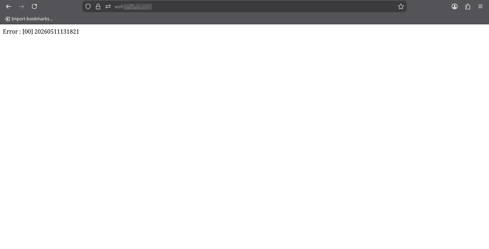
> 
> **B. WAFR Kubernetes**
> 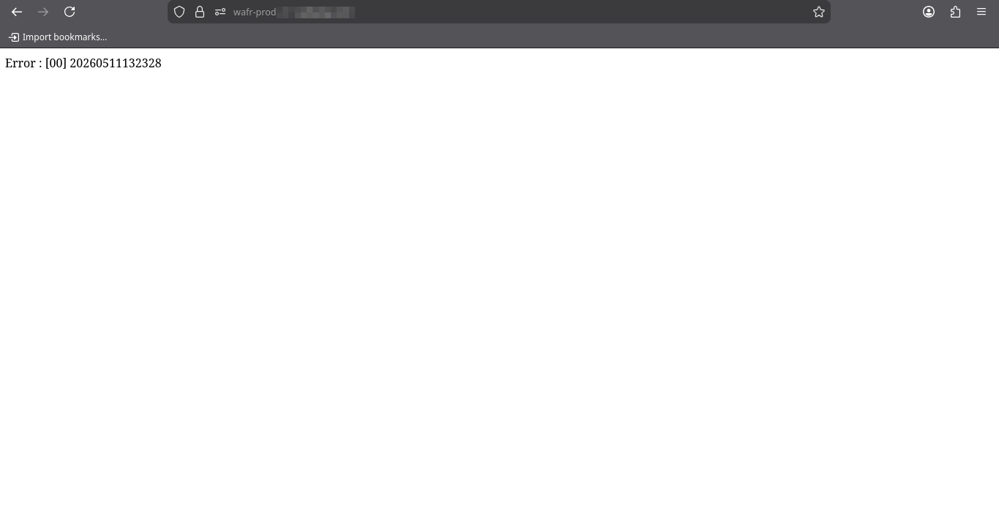

**2. Navigasi & Rendering Data**
*   **Daftar Report:** Pengujian difokuskan pada menu **Service Berkala**. Hasilnya, *list* data yang dirender pada WAFR Kubernetes 100% identik dengan Legacy.
*   **Detail Isi Report:** Saat menelusuri detail dari record **Service Berkala**, informasi yang ditarik dari database Production berhasil ditampilkan secara akurat di Kubernetes tanpa ada *data loss* atau salah format.

**3. Fungsionalitas Pencarian & Filter**
*   **Aksi:** Melakukan filter berdasarkan kolom **"Dikerjakan oleh"** dengan *keyword* pencarian **"Bengkel rekanan"**.
*   **Hasil:** Sistem *routing* dan *query* pada WAFR Kubernetes berjalan normal dan menghasilkan output tabel yang sama persis dengan sistem Legacy.

---
**Kesimpulan:**
Aplikasi WAFR di Kubernetes terbukti **LULUS** validasi data. Aplikasi dapat merender UI, menarik data dari database Production, dan menjalankan fungsi filter dengan perilaku yang identik dengan environment Legacy.

**Catatan Tambahan:** 
Tidak ditemukan masalah, *error log*, atau anomali jaringan selama pengetesan TC-01 berlangsung.

#### **2. TC-02: Pod Failure — Ketersediaan Aplikasi saat Pod Dimatikan**
**Status:** ✅ Lulus | **Tanggal:** 11 Mei 2026 | **PIC:** Elang

Berikut adalah rincian hasil pengujian resiliensi pod WAFR:

**1. Eksekusi Simulasi Kegagalan**
*   **Aksi:** 
    1. Membuka terminal pemantauan untuk mengamati status pod di *namespace* `wafr-wahana` secara *real-time*:
    ```bash
    kubectl get pods -n wafr-wahana -o wide -w
    ```
    *Output Awal:*
    ```text
    NAME                         READY   STATUS    RESTARTS   AGE   IP               NODE          
    wafr-app-5774d48dd-blrcp     1/1     Running   0          2d    10.244.100.205   k8s-worker3   
    wafr-app-5774d48dd-xllg5     1/1     Running   0          2d    10.244.24.223    k8s-worker4   
    wafr-nginx-b56d67dbc-994km   1/1     Running   0          2d    10.244.100.250   k8s-worker3   
    wafr-nginx-b56d67dbc-xt4lp   1/1     Running   0          2d    10.244.24.222    k8s-worker4

2. Menghapus salah satu pod replica `wafr-app` (simulasi *crash*/*failure*) menggunakan terminal terpisah:
    ```bash
    kubectl delete pods -n wafr-wahana wafr-app-    5774d48dd-blrcp
    ```

*   **Observasi Sistem:** 
    Kubernetes Controller langsung mendeteksi hilangnya satu pod dan secara otomatis melakukan *provisioning* pod pengganti untuk menjaga jumlah *replica* tetap stabil.
    *   **Waktu eksekusi delete:** 14:29:20 WIB
    *   **Waktu pod baru Ready:** 14:29:33 WIB
    *   **Durasi recovery:** ~13 detik.

*Bukti Visual:*
> **Log Terminal: Proses Delete Pod**
> 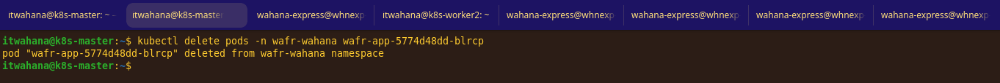
> 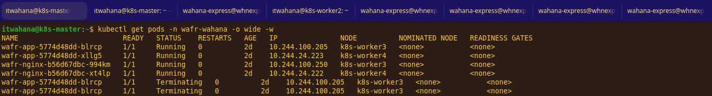
> 
> **Log Terminal: Proses Create Ulang Pod**
> 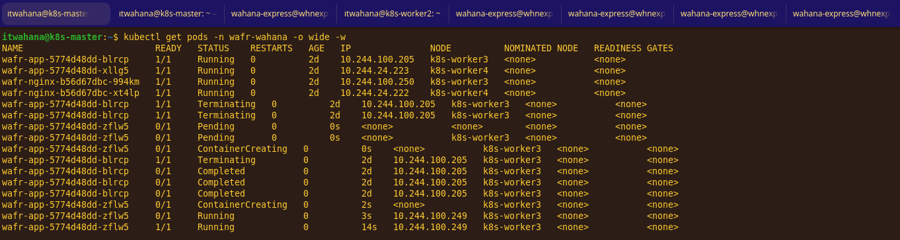

**2. Ketersediaan Aplikasi (Zero Downtime Check)**
*   **Aksi:** Melakukan *monitoring* secara konstan pada *endpoint* aplikasi WAFR selama jendela waktu *terminate* (14:29:20) hingga pod baru terbentuk (14:29:33).
*   **Hasil:** Aplikasi tetap dapat diakses dengan lancar. Tidak ada temuan *request drop* (HTTP 502/503) atau *timeout*. Kube-proxy / Service secara otomatis mengalihkan seluruh *traffic* masuk ke pod replica kedua (`wafr-app-5774d48dd-xllg5`) yang berada di `k8s-worker4` yang masih berstatus sehat.

---
**Kesimpulan: LULUS.** Kubernetes terbukti mampu menjaga *High Availability* (HA) aplikasi WAFR. Saat terjadi simulasi kegagalan pada salah satu pod, fitur *self-healing* berjalan dengan sangat baik (pemulihan dalam 13 detik) dan aplikasi mengalami **Zero Downtime**.

**Catatan Tambahan:**
Perilaku *load balancing* pada Service Kubernetes bekerja sesuai ekspektasi. Pod yang sedang dalam fase *Terminating* langsung dicabut dari *endpoint* Service sehingga tidak menerima *traffic* baru yang bisa menyebabkan *error* di sisi *user*.

<br>

#### **TC-03: Node Failure — Pod Rescheduling & Zero Downtime**
**Status:** ⬜ Belum | **Tanggal:** [DD/MM/YYYY] | **PIC:** [Nama PIC]

Berikut adalah rincian hasil pengujian ketersediaan node pada Cluster Kubernetes:

**1. Simulasi Node Mati**
*   **Aksi:** Mematikan / melakukan *drain* pada worker node `[IP Node Target, misal: 192.168.200.102]` yang sedang menjalankan pod WAFR.
*   **Observasi Sistem:** [Jelaskan respons cluster, misal: "Status node berubah menjadi NotReady/SchedulingDisabled. Pod yang ada di node tersebut langsung di-*evict*."]

*Bukti Visual:*
> **Status Node & Pod Rescheduling**
> 

**2. Rescheduling & Ketersediaan**
*   **Aksi:** Memantau proses pemindahan pod ke worker node lain (misal ke `192.168.200.103`) dan mengecek akses aplikasi.
*   **Hasil:** [Jelaskan durasi waktu yang dibutuhkan pod untuk running di node baru, dan apakah ada *downtime* pada aplikasi.]

---
**Kesimpulan:**
[Lulus/Gagal. Berikan ringkasan singkat hasil pengujian simulasi node mati.]

**Catatan Tambahan:**
[-]

<br>

#### **TC-04: Rolling Update tanpa Downtime**
**Status:** ✅ Lulus | **Tanggal:** 12 Mei 2026 | **PIC:** Elang

Berikut adalah rincian hasil pengujian pembaruan versi (update) aplikasi WAFR menggunakan strategi *Rolling Update*:

**1. Eksekusi Rolling Update**
*   **Aksi:** Mengubah manifest *deployment* aplikasi WAFR untuk melakukan *upgrade* versi *image container* dari `wafr_web_k8s:0.1.02` menjadi `wafr_web_k8s:0.1.03`.

*Bukti Visual:*
> **Manifest Sebelum Update (Tag 0.1.02)**
> 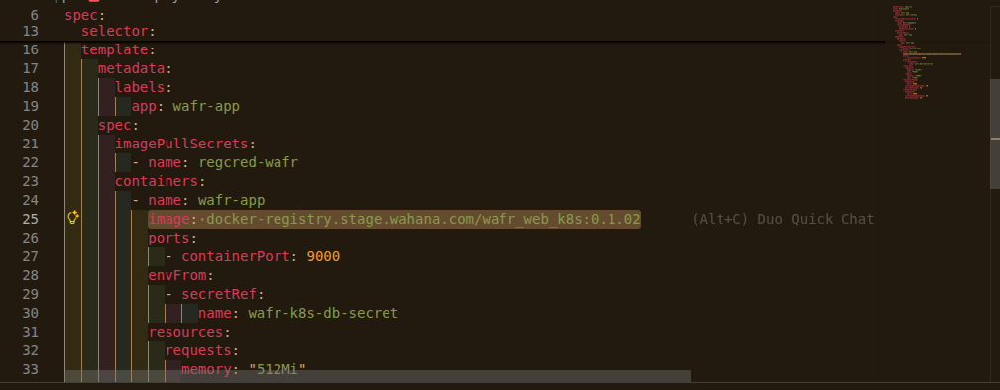
> 
> **Manifest Setelah Update (Tag 0.1.03)**
> 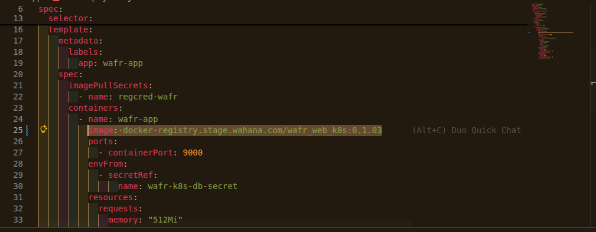

*   **Observasi Rollout:** 
    Kubernetes mengeksekusi transisi versi dengan sangat mulus. Selama pod versi baru (`0.1.03`) masih dalam fase `ContainerCreating`, pod versi lama (`0.1.02`) tidak langsung dimatikan dan tetap dipertahankan dalam status *Running* untuk melayani *traffic*. Pod versi lama baru mulai di-*terminate* secara bertahap hanya setelah pod versi terbaru berstatus *Ready* serta *Running* dan siap menerima beban kerja.

*Bukti Visual:*
> **Status Pod Saat Proses Rollout Berlangsung**
> 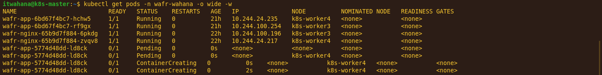
> 
> **Status Pod Setelah Rollout Selesai**
> 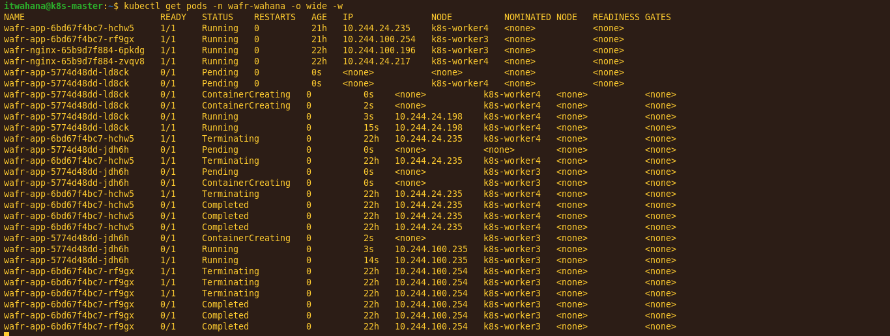
> 
> **Konfirmasi Rollout Deployment**
> 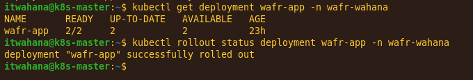

**2. Ketersediaan Selama Update (Zero Downtime Check)**
*   **Aksi:** Melakukan pengujian aksesibilitas UI/website aplikasi WAFR tepat saat proses transisi pod sedang berlangsung.
*   **Hasil:** Aplikasi beroperasi secara normal tanpa gangguan. Tidak ditemukan adanya *request drop*, *error* HTTP 502 Bad Gateway, maupun *request timeout* bagi *user* yang sedang mengakses sistem.

*Bukti Visual:*
> **Akses Website Saat Transisi Berlangsung**
> 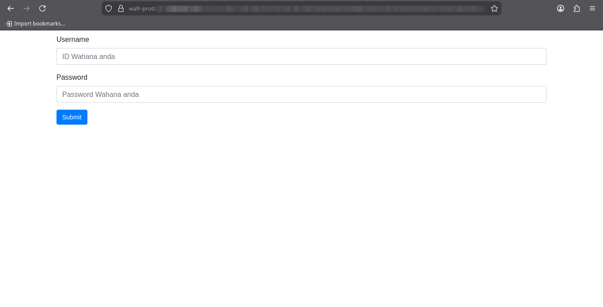

---
**Kesimpulan:**
**LULUS.** Pengujian membuktikan bahwa fitur *Rolling Update* di Kubernetes berjalan sempurna untuk skenario *High Availability* aplikasi WAFR. Pembaruan versi aplikasi dapat dilakukan dengan aman langsung di *environment production* dengan capaian **Zero Downtime**, sehingga meminimalisir gangguan operasional pada *end-user*.

**Catatan Tambahan:**
Perilaku *load balancer* dan Service Kubernetes terbukti efektif dalam membagi dan menahan *traffic* dari pod yang sedang dimatikan ke pod baru yang sudah lolos *readiness probe*.

<br>

#### **TC-05: Load & Performance Baseline**
**Status:** ✅ Lulus | **Tanggal:** 12 Mei 2026 | **PIC:** Elang

Pengujian beban (*Stress Test*) menggunakan **Locust** dengan menyimulasikan *request* ke *endpoint* aplikasi WAFR di Kubernetes untuk mengukur kapasitas maksimal dan efisiensi *auto-scaling*.

**1. Metrik Hasil Load Test**
Pengujian dilakukan dengan durasi eksekusi selama **5 menit** dan memberikan beban *konstan* sebanyak **2.000 concurrent users**.

| Metrik | Hasil K8s | Target | Status |
| :--- | :--- | :--- | :--- |
| **Avg Response Time** | `7961.44` ms | - | ℹ️ *Lihat catatan* |
| **P95 Response Time** | `24000` ms | - | ℹ️ *Lihat catatan* |
| **Throughput (req/s)** | `213.06` rps | - | ✅ Lulus |
| **Error Rate** | **`3%`** | < 10% | ✅ Lulus |

*Bukti Visual:*
> **Locust Test Report (RPS & Response Times)**
> 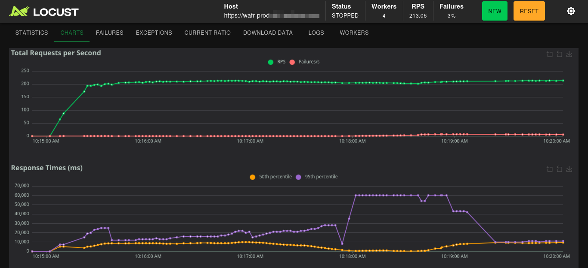

**2. Analisa Performa & Resource Usage**
* **Perilaku Auto-scaling (HPA):** Mekanisme *Horizontal Pod Autoscaler* (HPA) merespons lonjakan trafik dengan sangat responsif. Beban masif dari Locust memicu HPA untuk melakukan *scale-out* secara otomatis. Pod WAFR berhasil bertambah dari *base* awal **2 replica** menjadi **5 replica** tanpa kendala (*zero crash loop*).
* **Resource Distribution:** Berdasarkan *monitoring* Grafana, distribusi beban CPU dan RAM di level pod sangat sehat. Penggunaan memori (*RSS Memory Usage*) per pod WAFR stabil di kisaran ~14 MiB (jauh di bawah *limit* 750 MiB). Di level *Worker Node*, utilisasi memori terdistribusi merata (berkisar antara 18% hingga 49%), membuktikan *Kubernetes Scheduler* bekerja efisien dalam membagi beban kerja ke node yang tersedia.

*Bukti Visual:*
> **Status HPA (Scale-out Pods)**
> 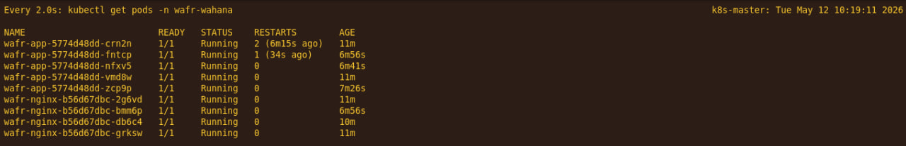
> 
> **Grafana Monitoring (CPU & Memory per Node/Pod)**
> 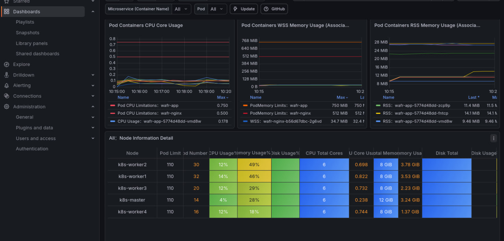

---
**Kesimpulan:**
**LULUS.** Aplikasi WAFR di atas Kubernetes berhasil melewati skenario pengujian beban ekstrem. Tingkat kegagalan (*Error Rate*) sangat rendah, yakni hanya **3%** (memenuhi kriteria lulus < 10%). Fitur HPA terbukti berfungsi sempurna untuk mencegah aplikasi tumbang (*down*) saat dihadapkan pada lonjakan 2.000 *user* secara bersamaan.

**Catatan Tambahan (Area Optimasi):**
Meskipun aplikasi tidak tumbang, angka *Avg Response Time* (~7.9 detik) dan *P95* (24 detik) pada beban puncak menunjukkan adanya latensi tinggi. Mengingat *resource* CPU/Memory pod belum menyentuh batas *limit*, *bottleneck* ini kemungkinan terjadi di batas koneksi (*connection pool*) ke *Database*, atau performa *query* internal aplikasi, yang dapat menjadi fokus optimasi pada fase berikutnya.
[-]

<br>

#### **TC-06: Koneksi Database**
**Status:** ⬜ Belum | **Tanggal:** [DD/MM/YYYY] | **PIC:** [Nama PIC]

**1. Verifikasi Koneksi Internal Pod**
*   **Aksi:** Mengecek apakah aplikasi WAFR berhasil me- *resolve* dan *connect* ke kredensial Database 120 melalui ConfigMap/Secret.
*   **Hasil:** [Jelaskan bahwa tidak ada error koneksi DB di *log container*.]

**2. Validasi Operasional Data**
*   **Aksi:** Melakukan *query* / akses data melalui UI untuk memastikan aliran data stabil.
*   **Hasil:** [Jelaskan respon aplikasi saat memuat data dalam jumlah besar/normal dari DB.]

---
**Kesimpulan:**
[Lulus/Gagal. Konfirmasi kelancaran I/O aplikasi ke database.]

**Catatan Tambahan:**
[-]

<br>

#### **TC-07: Redis Sentinel — Validasi Penyimpanan Cache & Failover**
**Status:** ⬜ Belum | **Tanggal:** [DD/MM/YYYY] | **PIC:** [Nama PIC]

Berikut adalah rincian pengujian integrasi WAFR dengan Redis Sentinel Cluster:

**1. Uji Operasi Read/Write ke Redis**
*   **Aksi:** Mengakses *endpoint* WAFR yang melakukan hit ke Redis, lalu memvalidasi *key* di sisi *Primary Redis* via `redis-cli`.
*   **Hasil:** [Jelaskan apakah data berhasil disimpan dan direplikasi ke 3 *read-replica/slave*.]

*Bukti Visual:*
> **Verifikasi Key Redis di Terminal**
> 

**2. Simulasi Failover (Primary Redis Mati)**
*   **Aksi:** Mematikan pod *Redis Primary* secara paksa.
*   **Observasi Sentinel:** [Jelaskan bagaimana Sentinel mendeteksi primary yang mati dan mem-*promote* salah satu replica menjadi primary baru (biasanya di bawah 30 detik).]
*   **Akses Aplikasi:** [Jelaskan apakah WAFR berhasil melakukan *auto-reconnect* ke primary baru dan tetap bisa melakukan *write* data.]

*Bukti Visual:*
> **Log Sentinel - Proses Failover**
> 

---
**Kesimpulan:**
[Lulus/Gagal. Rangkuman keberhasilan Sentinel menjaga *state* dan *cache* aplikasi tanpa intervensi manual.]

**Catatan Tambahan:**
[Catat jika ada error sementara (seperti aplikasi melempar *exception Not connected* sesaat sebelum Sentinel selesai melakukan failover).]

---

## 8. Risiko & Mitigasi

| Risiko | Dampak | Kemungkinan | Mitigasi |
|---|---|---|---|
| Pod WAFR dijadwalkan di worker node yang sama | Jika node itu mati, kedua pod ikut mati (downtime) | Sedang | Pastikan HPA aktif agar Kubernetes langsung assign pod baru ke worker lain |
| Koneksi database putus saat pod restart | Data tidak bisa diakses | Rendah | Pastikan `readinessProbe` sudah di-set untuk memastikan pod sudah ready atau belum untuk menerima request |
| Redis tidak dapat dijangkau dari pod | Fitur session/cache tidak berfungsi | Sedang | Verifikasi network policy dan env var Sentinel di tiap pod; pastikan aplikasi terhubung ke Sentinel service, bukan IP primary langsung |
| Quorum Sentinel tidak terpenuhi saat failover | Failover tidak terjadi, primary tidak bisa diganti | Rendah | Pastikan 3 Sentinel pod running di node berbeda; quorum default = 2 dari 3 |
| Aplikasi tidak support koneksi via Sentinel | Aplikasi tidak bisa auto-reconnect ke primary baru | Sedang | Pastikan library Redis yang digunakan mendukung Sentinel mode (Jedis, ioredis, redis-py, dsb.) |
| Split-brain: dua pod mengklaim sebagai primary | Data inconsistency / write conflict | Rendah | Sentinel menangani ini via quorum; pastikan tidak ada koneksi langsung ke pod Redis yang bypass Sentinel |
| Image pull lambat saat rescheduling ke worker lain | Pod baru lama menjadi Ready | Sedang | Pre-pull image di semua worker node, atau gunakan registry lokal |
| Resource limit tidak sesuai | Pod OOMKilled atau throttled | Sedang | Set `requests` dan `limits` sesuai hasil TC-05 |
| Perbedaan konfigurasi (env var, secret) | Perilaku aplikasi berbeda dari legacy | Sedang | Audit semua env var legacy vs ConfigMap/Secret Kubernetes |

---

> **Catatan:** Dokumen ini bersifat living document dan dapat diperbarui seiring progress pengujian.