# Panduan Penggunaan Taiga — Project Management

### Taiga.io · Self-Hosted · Onboarding Pengguna Baru

Dokumentasi ini menjelaskan langkah-demi-langkah cara menggunakan Taiga sebagai platform manajemen proyek, mulai dari:

- Memahami konsep dasar dan hierarki kerja di Taiga
- Membuat dan mengelola Project
- Mengelola Backlog, Sprint, dan Kanban Board
- Membuat dan mengorganisir Epic, User Story, Task, dan Issue
- Tips & trik untuk penggunaan sehari-hari

---

## 1. Apa itu Taiga?

Taiga adalah platform manajemen proyek open-source yang mendukung metodologi **Scrum** dan **Kanban**. Taiga dirancang untuk tim pengembang software, desainer, dan manajer proyek yang ingin mengelola pekerjaan secara terstruktur dan transparan.

Instance Taiga yang Anda gunakan berjalan secara **self-hosted di atas Kubernetes cluster** internal, sehingga seluruh data proyek tersimpan di infrastruktur organisasi Anda sendiri.

### Keunggulan Taiga:
- **Kontrol penuh** atas data — semua tersimpan di server internal
- Mendukung **Scrum** (Sprint-based) dan **Kanban** (flow-based) dalam satu project
- Interface yang bersih dan mudah dipahami
- Tidak bergantung pada layanan cloud eksternal

### Informasi Akses Instance Ini:

| Parameter | Nilai |
|---|---|
| **URL Aplikasi** | `http://taiga-vm` |
| **Protokol** | HTTP |
| **Admin Panel** | `http://taiga-vm/admin` |

> ⚠️ **Pastikan** komputer Anda sudah dapat mengakses domain `taiga-vm`. Jika tidak bisa membuka URL di atas, hubungi administrator untuk memastikan konfigurasi DNS atau `/etc/hosts` sudah benar.

---

## 2. Konsep Dasar & Hierarki Kerja

Sebelum mulai menggunakan Taiga, penting untuk memahami hierarki dan hubungan antar elemen di dalamnya.

### 2.1 Hierarki Elemen

```
Workspace (Organisasi)
└── Project
    ├── Epic
    │   └── User Story
    │       ├── Task
    │       └── (terhubung ke Sprint / Kanban)
    └── Issue
```

### 2.2 Penjelasan Setiap Elemen

| Elemen | Deskripsi |
|---|---|
| **Workspace** | Ruang kerja utama, biasanya mewakili organisasi atau tim besar |
| **Project** | Satu proyek spesifik dalam workspace |
| **Epic** | Fitur besar yang terdiri dari banyak User Story |
| **User Story** | Kebutuhan pengguna yang bisa dikerjakan dalam satu Sprint |
| **Task** | Pekerjaan teknis spesifik di dalam sebuah User Story |
| **Issue** | Bug, pertanyaan, atau pekerjaan di luar backlog normal |
| **Sprint** | Periode waktu kerja (biasanya 1-4 minggu) dalam Scrum |

> ✅ **Tips untuk pemula:** Mulailah dengan memahami alur **Epic → User Story → Task** terlebih dahulu, karena ini adalah inti dari cara kerja di Taiga.

---

## 3. Memulai — Registrasi & Login

### 3.1 Membuat Akun

Di instance self-hosted ini, ada **dua cara** untuk mendapatkan akun:

**Cara A — Registrasi Mandiri (jika diaktifkan admin):**

1. Buka browser dan kunjungi **`http://taiga-vm`**
2. Klik tombol **"Sign up"**
3. Isi form registrasi:
   - **Username** — nama unik Anda (tidak bisa diubah setelah dibuat)
   - **Full Name** — nama lengkap Anda
   - **Email** — alamat email aktif
   - **Password** — minimal 6 karakter
4. Klik **"Sign up"**
5. Cek inbox email Anda untuk link verifikasi, lalu klik link tersebut

> 📧 **Email verifikasi** dikirim dari `kubectlang@gmail.com` via SMTP Gmail. Jika tidak menemukan emailnya, cek folder **Spam/Junk**.

**Cara B — Dibuat oleh Administrator:**

Jika fitur registrasi mandiri dinonaktifkan, Administrator akan membuatkan akun Anda melalui Admin Panel (`http://taiga-vm/admin`) dan mengirimkan kredensial login secara langsung.

> ⚠️ **Perhatian:** Username bersifat **permanen** dan akan terlihat oleh semua anggota tim. Pilih username yang profesional.

### 3.2 Login

1. Buka **`http://taiga-vm`** di browser
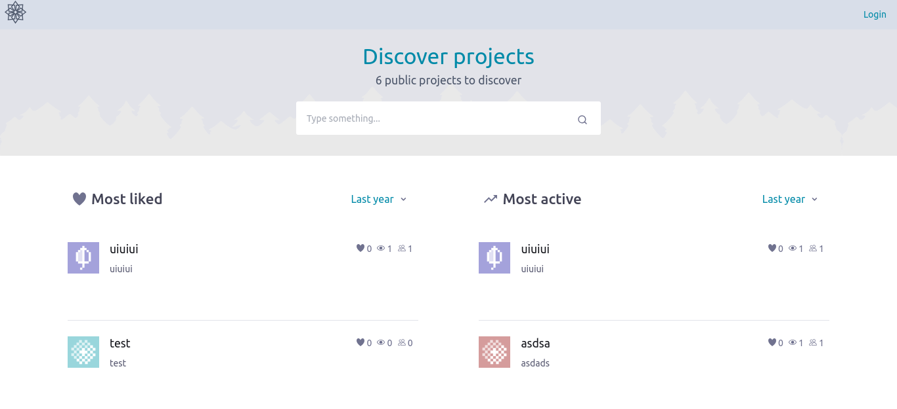

2. Klik **"Login"**
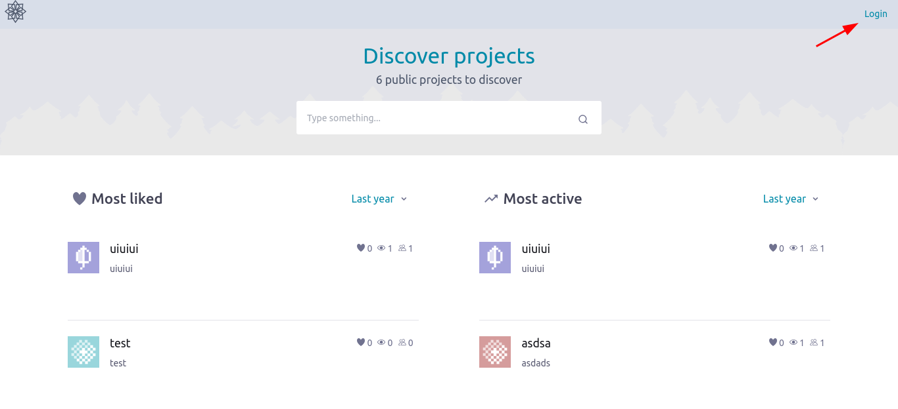

3. Masukkan **username atau email** dan **password**
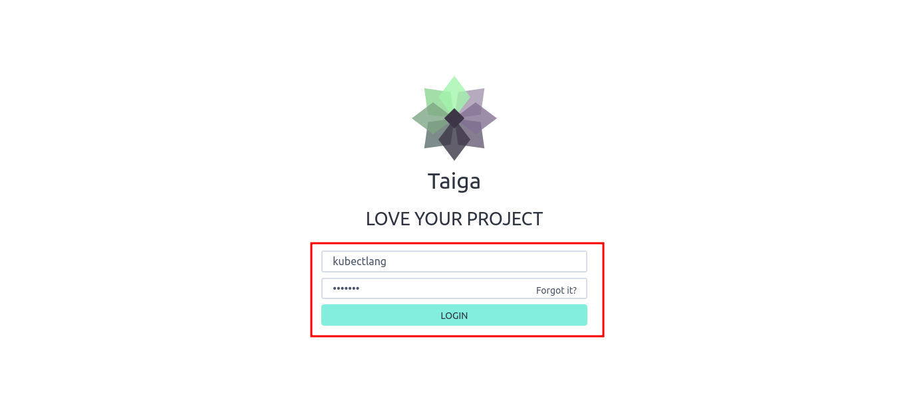

4. Klik **"Login"**


Setelah login, Anda akan masuk ke halaman **Dashboard** utama yang menampilkan semua project Anda.

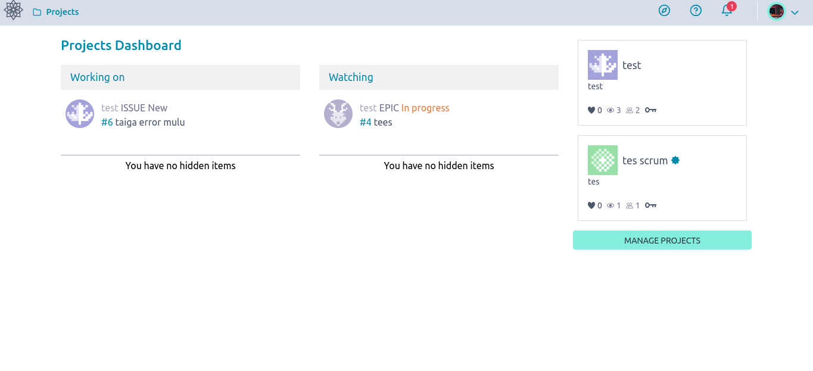

> 💡 **Tidak bisa login?** Pastikan Anda mengakses `http://taiga-vm` (bukan `https://`). Instance ini berjalan di atas HTTP. Jika tetap gagal, hubungi administrator.

---

## 4. Membuat Project Baru

Project adalah wadah utama pekerjaan Anda di Taiga. Setiap project bisa menggunakan metodologi Scrum, Kanban, atau keduanya.

### 4.1 Langkah Membuat Project

1. Dari halaman Dashboard, klik tombol **"Project"** di sebelah kiri atas, lalu pilih **New Project**

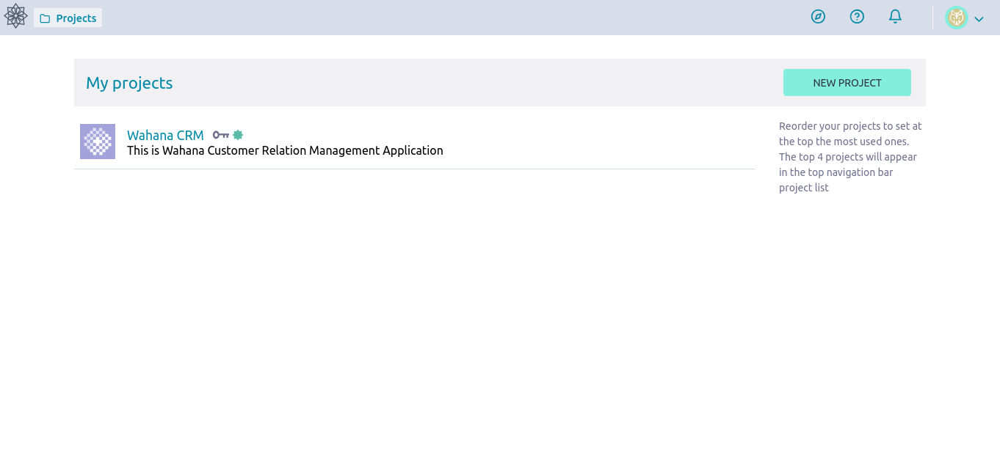

2. Pilih **template project** yang sesuai:

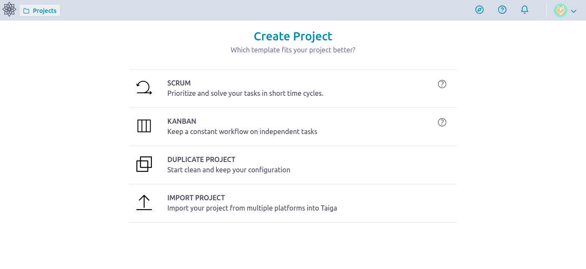

| Template | Cocok Untuk | Fitur Utama |
|---|---|---|
| **Scrum** | Tim yang bekerja dengan Sprint terjadwal | Backlog, Sprint, Velocity |
| **Kanban** | Tim yang mengelola alur kerja berkelanjutan | Kanban Board, WIP Limit |

3. Isi detail project:
   - **Name** — nama project
   - **Description** — deskripsi singkat tujuan project
   - **Privacy** — pilih `Public` (bisa dilihat siapa saja) atau `Private` (hanya anggota tim)
4. Klik **"Create Project"**

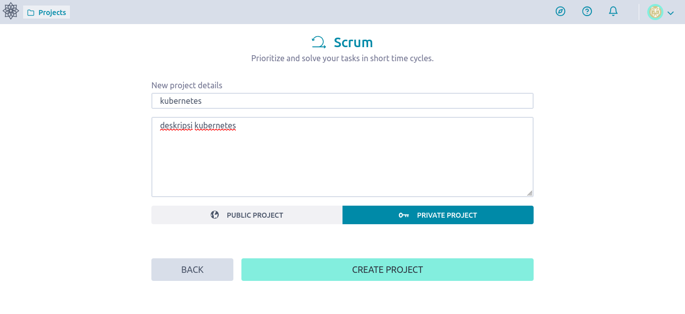

> ✅ **Rekomendasi:** Untuk kebanyakan tim, pilih template **Scrum** agar Anda mendapatkan fitur Backlog, Sprint, dan Board sekaligus.

### 4.2 Mengundang Anggota Tim

Setelah project dibuat, undang rekan kerja Anda:

1. Buka project, lalu klik **"Settings"** di sidebar kiri

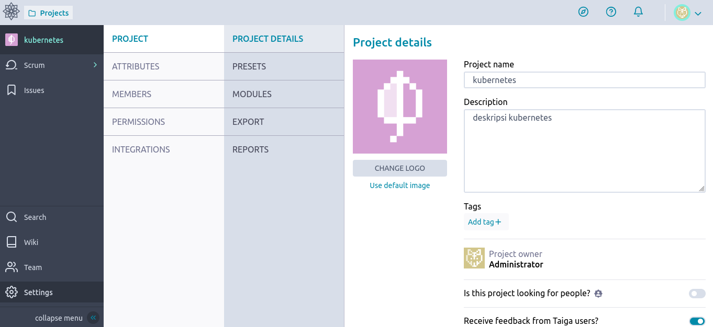

2. Pilih menu **"Members"**

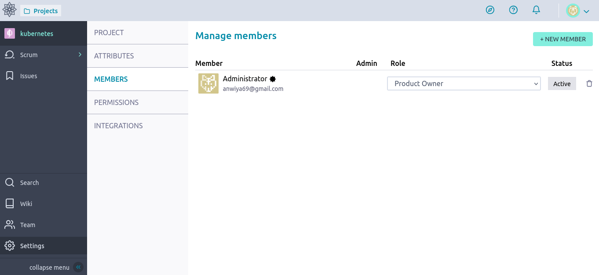

3. Klik **"New Member"**

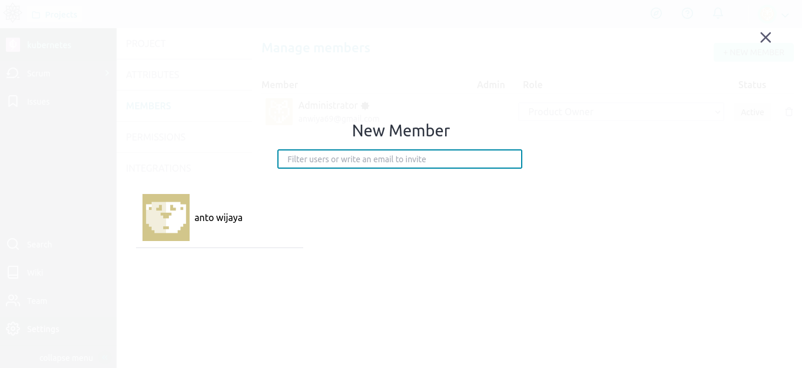

4. Masukkan **email** rekan kerja atau **username** Taiga mereka

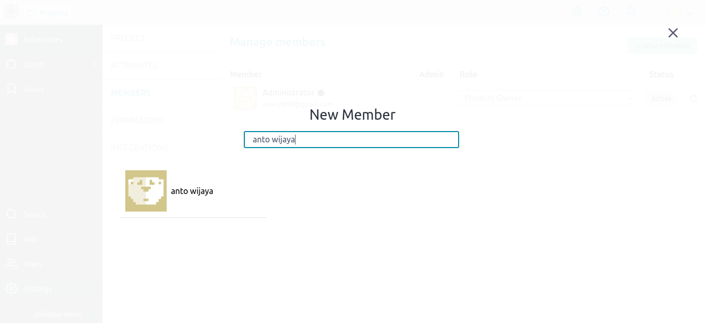

5. Pilih **Role** yang sesuai:

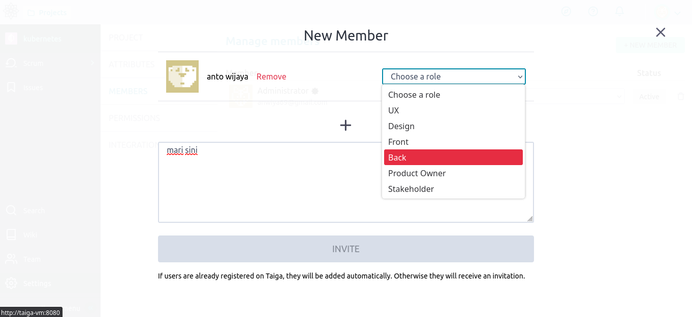

<!-- | Role | Akses |
|---|---|
| **Owner** | Akses penuh, termasuk hapus project |
| **Admin** | Kelola settings, member, dan semua konten |
| **Member** | Buat dan edit story, task, issue |
| **Viewer** | Hanya bisa melihat, tidak bisa edit | -->

6. Klik **"Send Invitation"**

Rekan kerja Anda akan menerima email undangan yang dikirim dari `kubectlang@gmail.com`. Email berisi link untuk mengaktifkan akun mereka. Jika mereka belum punya akun di instance ini, mereka akan diminta membuat akun terlebih dahulu.

> 📧 **Jika email undangan tidak diterima**, minta rekan kerja untuk cek folder Spam/Junk. Jika tetap tidak ada, administrator dapat membuatkan akun secara manual melalui `http://taiga-vm/admin`.

---

## 5. Mengelola Epic

Epic adalah unit pekerjaan terbesar dalam project. Epic mewakili sebuah fitur besar atau tema pekerjaan yang akan dipecah menjadi banyak User Story.

### 5.1 Mengapa Perlu Epic?

Bayangkan Anda membangun sebuah aplikasi e-commerce. Epic bisa berupa:
- 🛒 **Modul Keranjang Belanja**
- 🔐 **Sistem Autentikasi**
- 💳 **Sistem Pembayaran**
- 📦 **Manajemen Produk**

Setiap Epic ini nantinya akan dipecah menjadi User Story yang lebih kecil dan bisa dikerjakan.

### 5.2 Membuat Epic

1. Di sidebar kiri project Anda, klik **"Epics"**

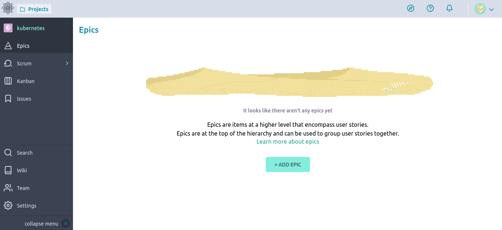

2. Klik tombol **"New Epic"** (atau klik tombol **+** biru)

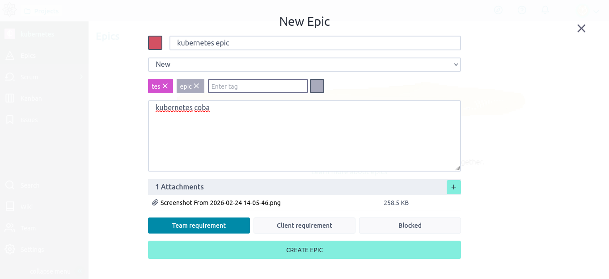

3. Isi detail Epic:
   - **Subject** — nama Epic (contoh: "Sistem Autentikasi")
   - **Description** — penjelasan lebih lengkap mengenai Epic ini
   - **Status** — `New`, `In Progress`, atau `Done`
   - **Tag** — bisa diisikan dengan fokus project
   - **Attachments** — gambar yang menjelaskan project

4. Klik **"Create Epic"**

### 5.3 Melihat Semua Epic

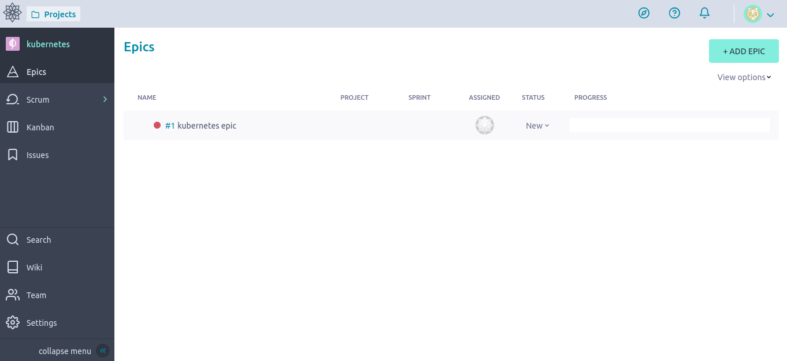

Halaman Epics menampilkan semua Epic dalam bentuk daftar beserta:
- **Progress bar** — persentase User Story yang sudah selesai
- **Jumlah User Story** yang terhubung
- **Assignee** dan **Status**

---

## 6. Mengelola User Story

User Story adalah unit pekerjaan inti di Taiga. Setiap User Story merepresentasikan satu kebutuhan atau fitur yang bisa diselesaikan dalam satu Sprint.

### 6.1 Format User Story yang Baik

User Story yang baik mengikuti format:

```
Sebagai [tipe pengguna],
Saya ingin [aksi/fitur],
Agar [manfaat/tujuan].
```

**Contoh:**
> Sebagai **pelanggan**, saya ingin **bisa login menggunakan akun Google**, agar **tidak perlu mengingat password baru**.

### 6.2 Membuat User Story

Terdapat 2 cara untuk menambahkan user story di taiga. Yang pertama bisa melalui menu **"Epics"** dan kedua melalui menu **"Scrum"**.

#### Cara 1, melalui Epics:

1. Buka Epic pada project taiga Anda.

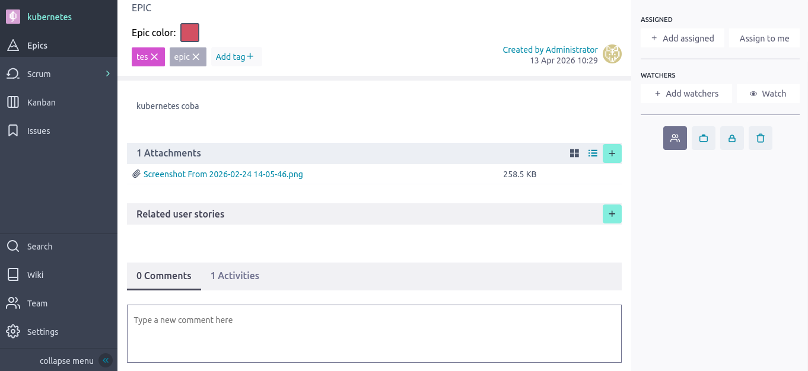

2. Pilih tanda **"*"** pada bagian **"Related user stories"**, lalu isikan subject untuk user story yang ingin ditambahkan.

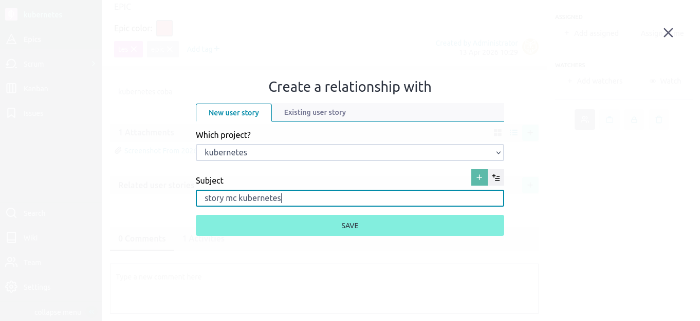

3. Tekan **"Save"** untuk menyimpan user story.

4. Untuk mengedit isi story dan assign ke user lain, bisa pilih menu **"Scrum"** di sidebar kiri dan pilih **"Backlog"**.

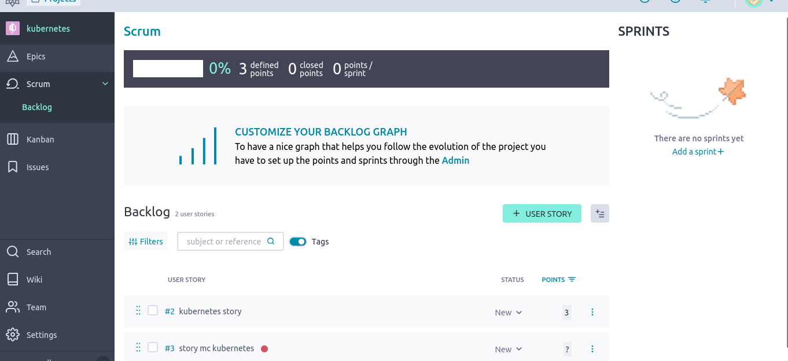

5. Jika sudah, pilih user story yang baru saja dibuat lalu edit isi dari user story tersebut.

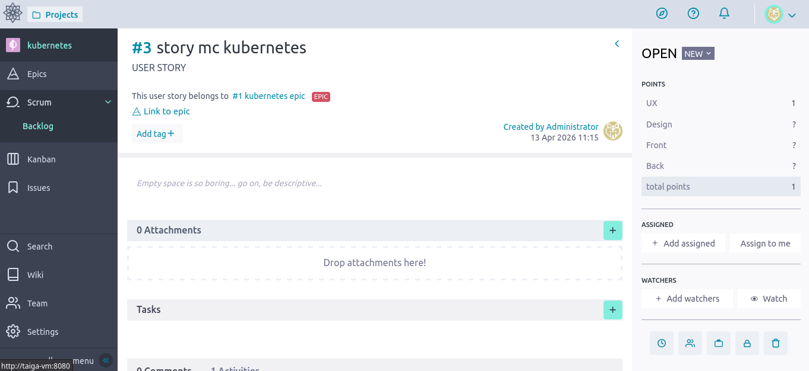


#### Cara 2:

1. Di sidebar kiri, klik **"Scrum"** lalu pilih **"User Story"**

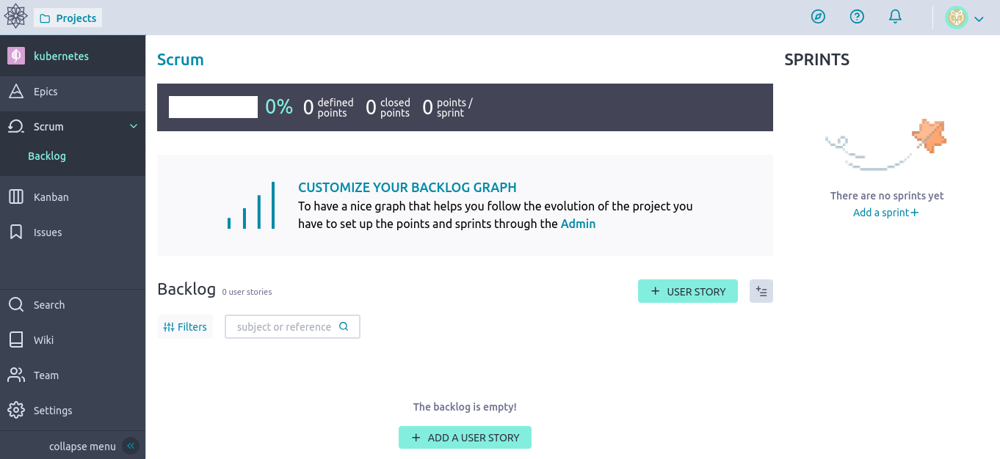

2. Klik tombol **"New User Story"** (tombol biru)

3. Isi detail

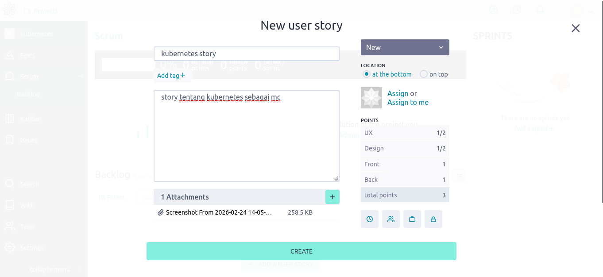

| Field | Fungsi |
|---|---|
| **Subject** | Judul singkat User Story |
| **Description** | Detail kebutuhan, acceptance criteria, dll |
| **Assign to** | Tetapkan pengerjaan ke member tim |
| **Points (Estimation)** | Estimasi kompleksitas dalam Story Points |
| **Tags** | Label untuk pengelompokan (contoh: `backend`, `ui`) |
| **Due Date** | Batas waktu pengerjaan |
| **Attachments** | Lampirkan file, screenshot, atau dokumen |

3. Klik **"Create"**

### 6.3 Story Points — Estimasi Kompleksitas

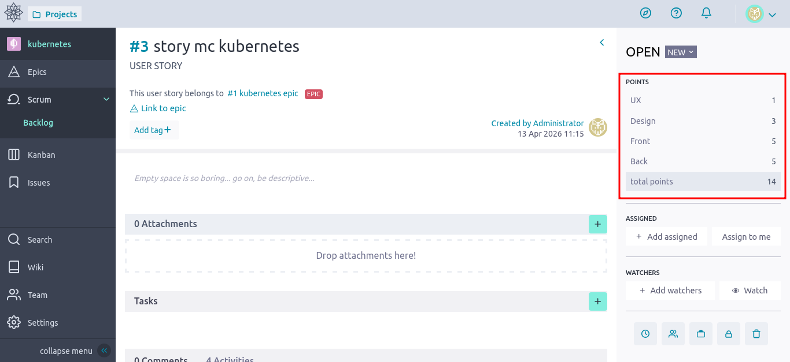

Story Points adalah angka yang merepresentasikan **tingkat kesulitan** (bukan durasi waktu) sebuah User Story. Taiga menggunakan skala Fibonacci secara default: **1, 2, 3, 5, 8, 13, 21**.

| Story Points | Artinya |
|---|---|
| **1** | Sangat mudah, bisa selesai dalam hitungan jam |
| **2-3** | Mudah, 1 hari kerja |
| **5** | Menengah, beberapa hari |
| **8** | Kompleks, hampir seminggu |
| **13+** | Sangat kompleks, pertimbangkan untuk dipecah lagi |

> ⚠️ **Aturan Praktis:** Jika sebuah User Story mendapat estimasi **13 atau lebih**, pertimbangkan untuk memecahnya menjadi beberapa User Story yang lebih kecil.

### 6.4 Mengubah Status User Story

Klik User Story untuk membuka detailnya, lalu ubah status menggunakan dropdown **Status**:

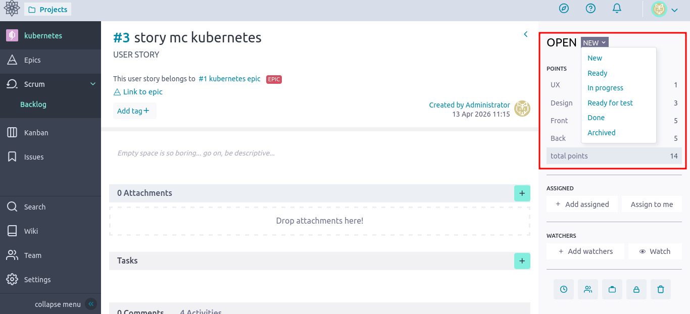

```
New → In Progress → Ready for Test → Done
```

Status bisa dikustomisasi di **Settings → Attributes → User Story Statuses**.

---

## 7. Mengelola Task

Task adalah pekerjaan teknis spesifik yang berada **di dalam** sebuah User Story. Jika User Story adalah "apa yang harus dicapai", maka Task adalah "bagaimana cara mencapainya".

### 7.1 Membuat Task

1. Buka detail sebuah User Story (klik judulnya)

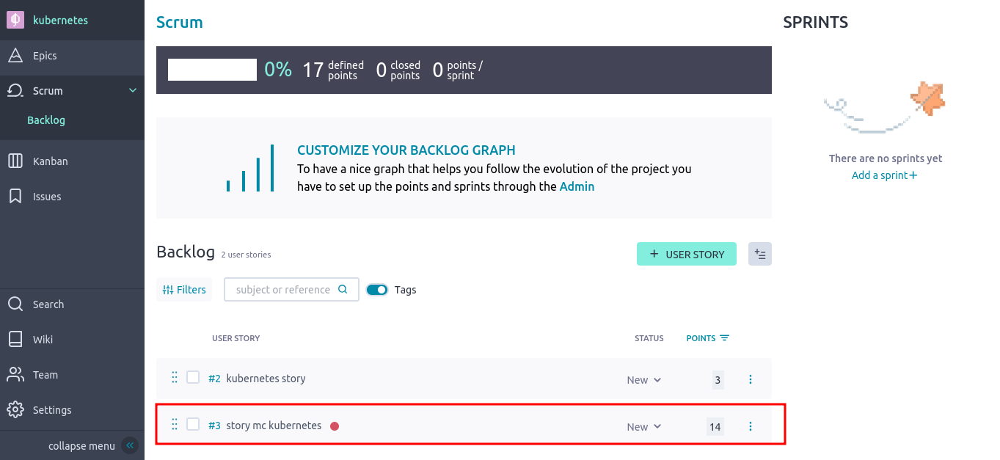

2. Gulir ke bagian **"Tasks"** di bagian bawah

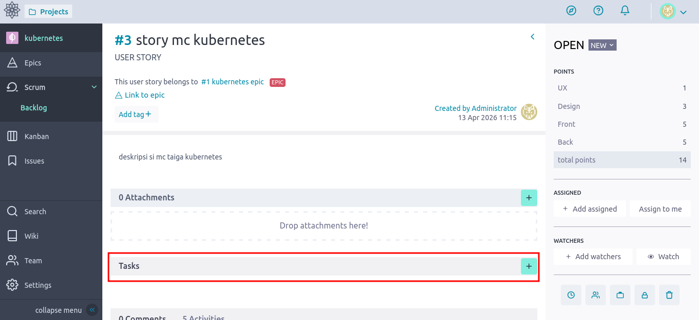

3. Klik **"Add Task"**

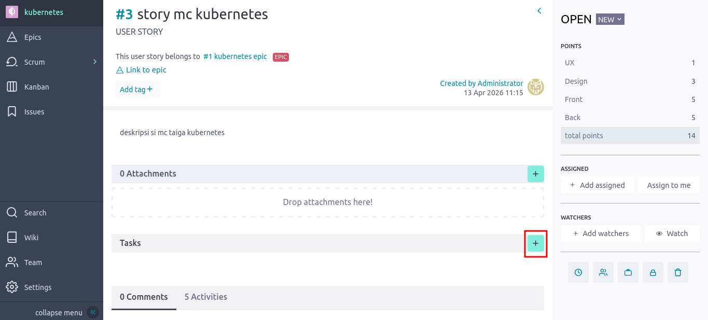

4. Isi detail Task:

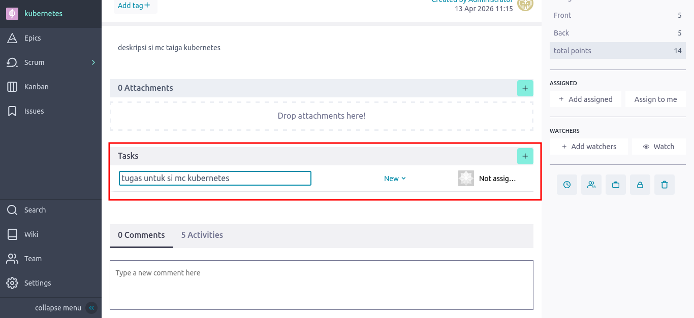

   - **Subject** — nama pekerjaan teknis (contoh: "Buat endpoint POST /auth/google")
   - **Assign to** — bisa berbeda dengan assignee User Story
   - **Status** — `New`, `In Progress`, atau `Done`
5. Klik **"Save"**

### 7.2 Hubungan User Story dan Task

Satu User Story bisa memiliki banyak Task. Contoh:

```
User Story: Login dengan Google
├── Task: Riset library OAuth2
├── Task: Buat endpoint POST /auth/google
├── Task: Integrasi dengan Google Developer Console
├── Task: Buat halaman redirect callback
└── Task: Tulis unit test untuk auth flow
```

Persentase **penyelesaian User Story** dihitung otomatis berdasarkan jumlah Task yang sudah berstatus `Done`.

> ✅ **Tips:** Usahakan setiap Task bisa diselesaikan dalam **1 hari kerja**. Jika lebih dari itu, pecah lagi menjadi Task yang lebih kecil.

---

## 8. Mengelola Issue

Issue digunakan untuk melacak **bug**, **pertanyaan teknis**, atau **permintaan mendadak** yang tidak masuk ke dalam perencanaan Sprint normal.

### 8.1 Perbedaan Issue vs User Story

| Aspek | User Story | Issue |
|---|---|---|
| **Asal** | Direncanakan, masuk Backlog | Muncul mendadak (bug, laporan) |
| **Metodologi** | Bagian dari Sprint Scrum | Independen dari Sprint |
| **Contoh** | "Tambahkan fitur export PDF" | "Tombol login tidak bisa diklik di Firefox" |

### 8.2 Membuat Issue

1. Di sidebar kiri, klik **"Issues"**

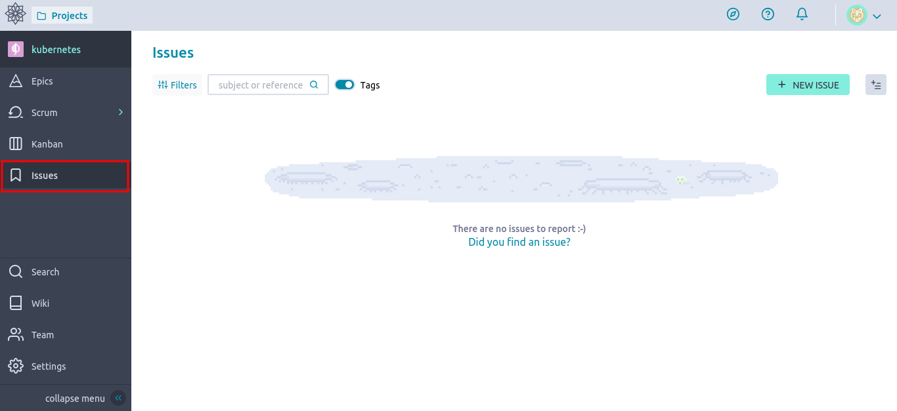

2. Klik tombol **"New Issue"**

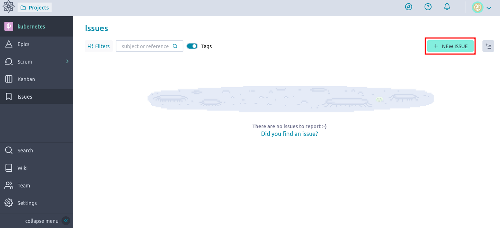

3. Isi detail Issue:

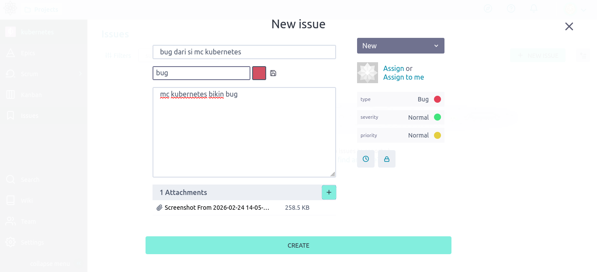

| Field | Fungsi |
|---|---|
| **Subject** | Judul singkat masalah |
| **Description** | Langkah reproduksi, expected vs actual behavior |
| **Type** | `Bug`, `Question`, atau `Enhancement` |
| **Priority** | `Low`, `Normal`, `High`, `Critical` |
| **Severity** | `Minor`, `Normal`, `Important`, `Critical` |
| **Assign to** | Member yang akan menangani |
| **Status** | `New`, `In Progress`, `Needs Info`, `Resolved`, `Closed` |

4. Klik **"Save"**

### 8.3 Alur Kerja Issue yang Direkomendasikan

```
New → In Progress → Needs Info (jika butuh klarifikasi) → Resolved → Closed
```

> ✅ **Tips:** Untuk bug yang ditemukan saat Sprint berlangsung, gunakan Issue agar tidak mengganggu alur Sprint. Setelah Sprint selesai, Issue yang valid bisa dikonversi menjadi User Story di Backlog.

---

## 9. Backlog — Mengelola Antrian Pekerjaan

Backlog adalah daftar **semua User Story** yang belum dikerjakan, diurutkan berdasarkan prioritas. Ini adalah "gudang pekerjaan" sebelum masuk ke Sprint.

### 9.1 Tampilan Backlog

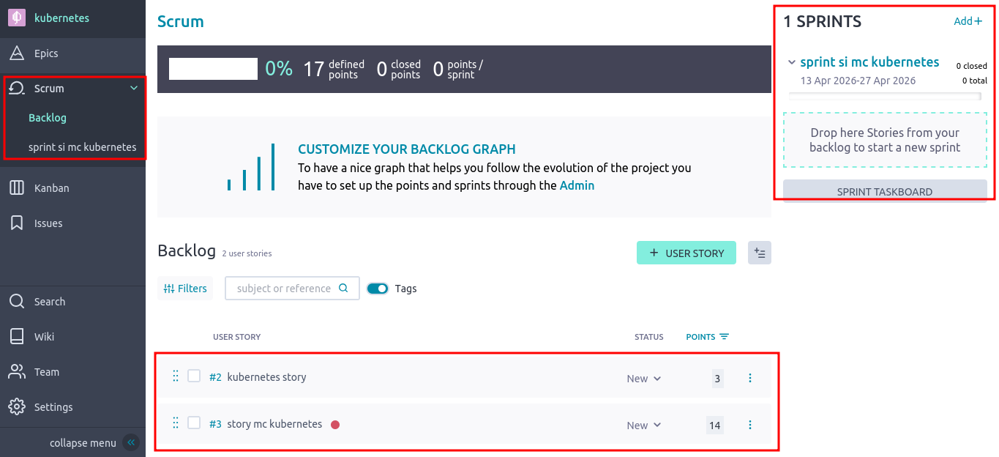

Halaman Backlog terbagi menjadi dua bagian:

```
┌─────────────────────────────────┐
│         SPRINT AKTIF            │  ← User Story yang sedang dikerjakan
│  Sprint 1 (10 Mar - 14 Apr)      │
│  [ ] Story A  [5 pts]           │
│  [✓] Story B  [3 pts]           │
├─────────────────────────────────┤
│           BACKLOG               │  ← Antrian pekerjaan berikutnya
│  Story C  [8 pts]               │
│  Story D  [2 pts]               │
│  Story E  [5 pts]               │
└─────────────────────────────────┘
```

### 9.2 Mengurutkan Prioritas Backlog

Urutan di Backlog mencerminkan prioritas — item paling atas adalah yang paling penting dan akan dikerjakan paling pertama.

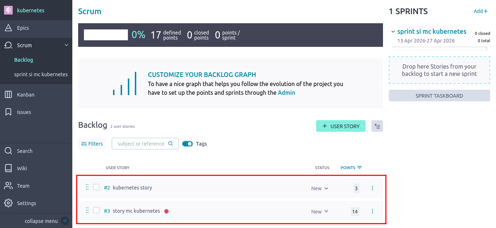

Untuk mengubah urutan:
**Drag and drop** — klik dan tahan icon `⠿` di kiri User Story, lalu seret ke posisi yang diinginkan

### 9.3 Filter & Pencarian di Backlog

Gunakan panel filter di sisi kiri untuk menyaring tampilan Backlog:

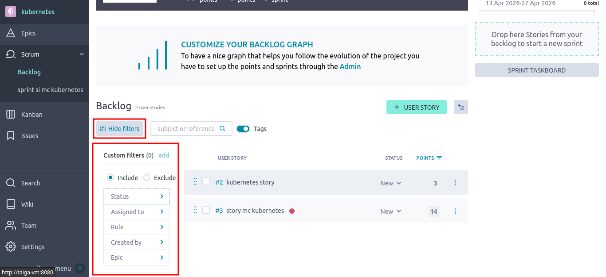

- **By Assignee** — lihat story milik member tertentu
- **By Epic** — lihat story berdasarkan Epic
- **By Tags** — filter berdasarkan label
- **By Status** — tampilkan hanya story dengan status tertentu

> ✅ **Tips Grooming Backlog:** Lakukan **Backlog Refinement/Penyempurnaan** secara rutin (biasanya seminggu sekali) bersama tim untuk memastikan semua User Story sudah memiliki estimasi, deskripsi yang jelas, dan urutan prioritas yang tepat.

---

## 10. Sprint — Mengelola Siklus Kerja

Sprint adalah periode waktu terbatas (biasanya 1-4 minggu) di mana tim berkomitmen untuk menyelesaikan sejumlah User Story dari Backlog.

### 10.1 Membuat Sprint

1. Di halaman **Backlog**, klik tombol **"New Sprint"** (di bagian atas halaman)

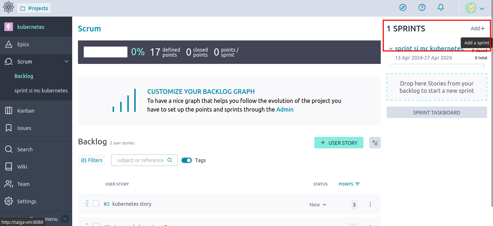

2. Isi detail Sprint:

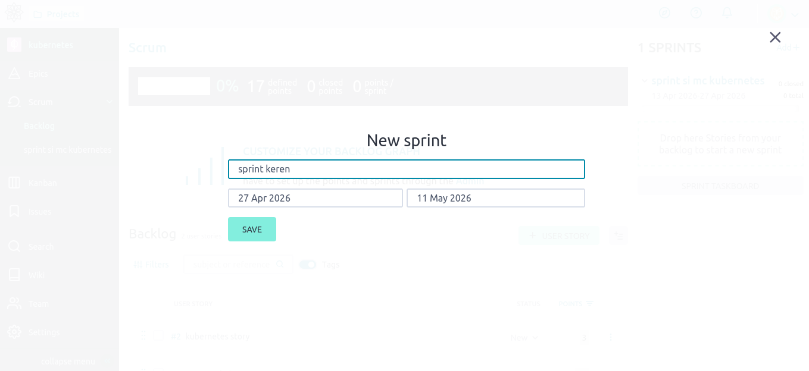

   - **Name** — nama Sprint (contoh: "Sprint 1" atau "Sprint Alpha")
   - **Start Date** — tanggal mulai Sprint
   - **End Date** — tanggal selesai Sprint
3. Klik **"Save"**

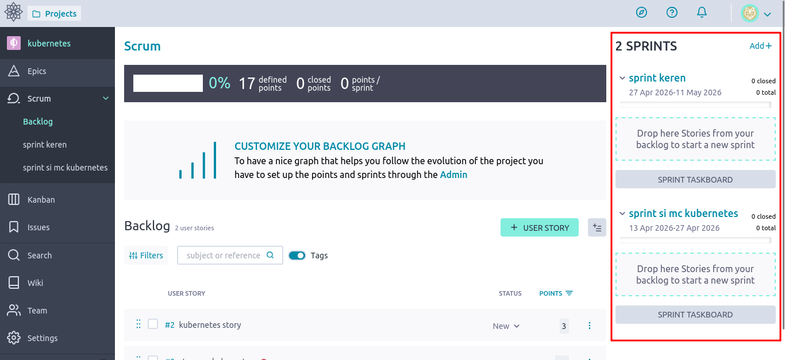

Sprint yang baru dibuat akan muncul di bagian sidebar kanan daftar Backlog dengan status **kosong**.

### 10.2 Mengisi Sprint dengan User Story

**Drag and Drop:**
Di halaman Backlog, klik dan seret User Story dari bagian Backlog ke bagian Sprint yang diinginkan

Contoh Sebelum drag and drop:

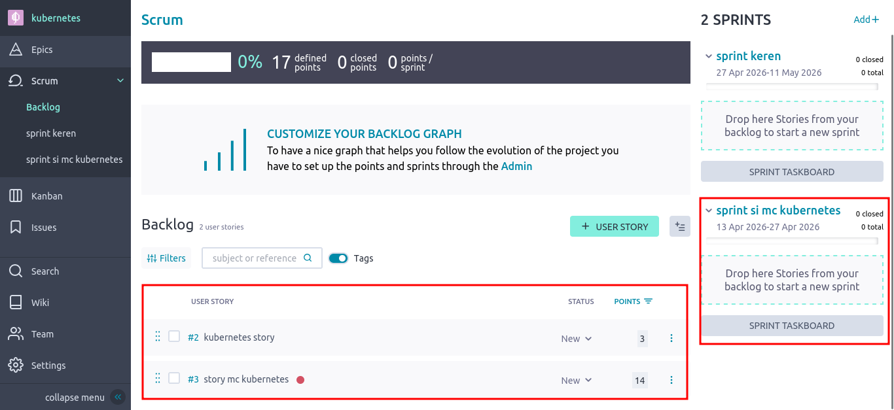

Setelah drag and drop:

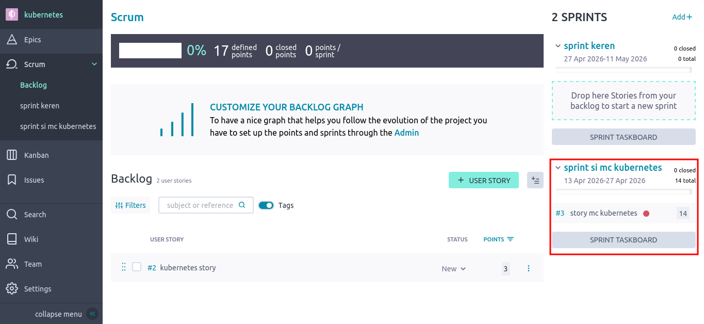

### 10.3 Sprint Planning — Menentukan Kapasitas

Sebelum memulai Sprint, pastikan jumlah Story Points yang dimasukkan sesuai dengan kapasitas tim.

**Cara menghitung kapasitas:**
```
Kapasitas Sprint = Jumlah Member × Hari Kerja × Rata-rata Velocity Harian
```

Taiga menampilkan **total Story Points** secara otomatis di header Sprint saat Anda mengisi Sprint dengan User Story.

> ✅ **Panduan umum:** Jangan isi Sprint terlalu penuh. Targetkan **70-80% dari kapasitas** agar tim punya ruang untuk hal tak terduga.

